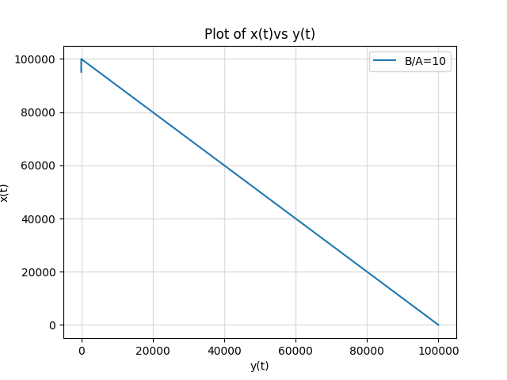
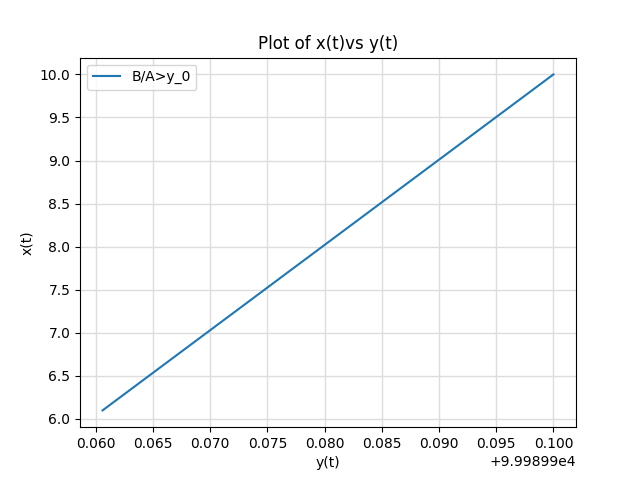
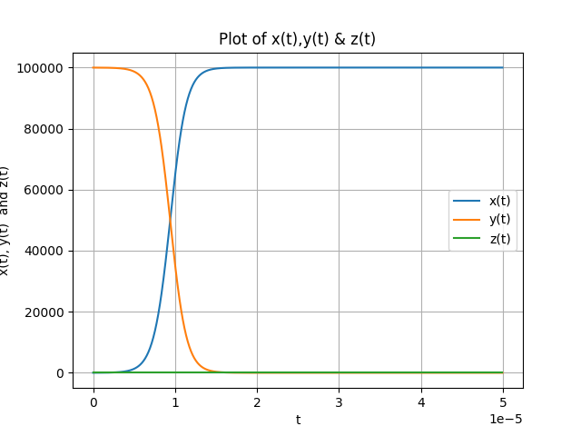
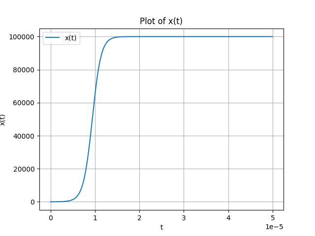
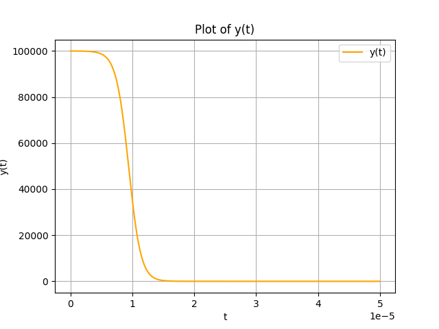
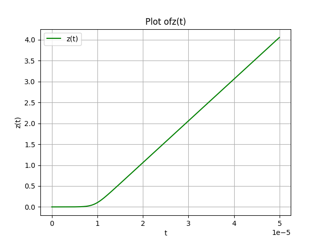
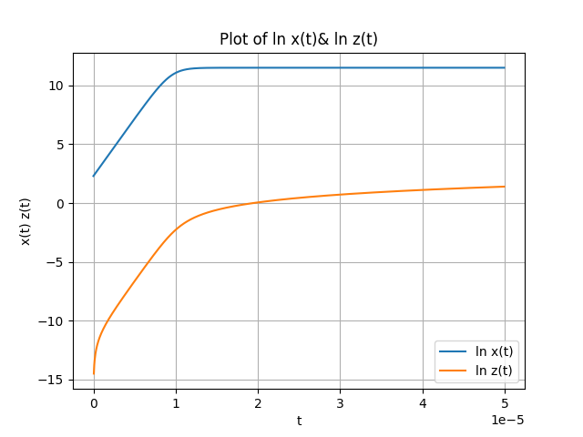
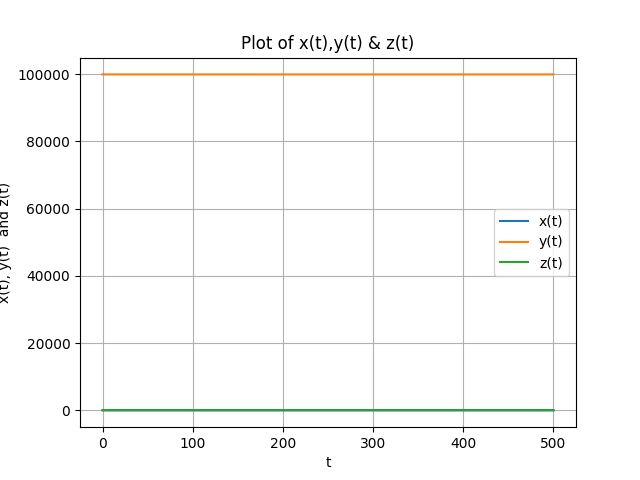

# Model of Epidemic spread

1) During the spread of an epidemic, the affected population is divided into three classes, namely, the infected, x, the susceptible, y, and the removed class, z. The last class can consist of both the recovered patients and those who have died because of the epidemic. 
2) For simplicity, assume that the disease is
non-fatal and, therefore, the removed class is made only of recovered patients, who acquire permanent immunity against the disease. Further, assume that the disease has a short incubation period. Under all these simplifying assumptions, we can write x(t) + y(t) + z(t) = N, in which N is the conserved
(constant) total number of the population, and x, y, z > 0.
3) The initial condition is that at t = 0, x(0) = x0 and z(0) = 0. Hence, y(0) = y0 = N − x0.
4) The value of x0 is small, i.e. initially a small number of infected persons introduce the disease in a
population of total number, N (x0 ≪ N). Thereafter, the growth rate of x is x˙ = Axy − Bx, the growth rate of y is y˙ = −Axy, and the growth rate of z is 
z˙ = Bx. In these coupled first-order equations, A is the infection rate and B is the removal rate (A, B > 0). Now define ρ = B/A.
5) According to the Threshold Theorem of Epidemiology, an epidemic will break out in a population if
y0 > ρ.
 

# Figure 1
 

 

# Figure 2

 

 

# Figure 3

 

 

# Figure 4

 

 

# Figure 5

 

 

# Figure 6
 

 

# Figure 7
 

 

# Figure 8

 

